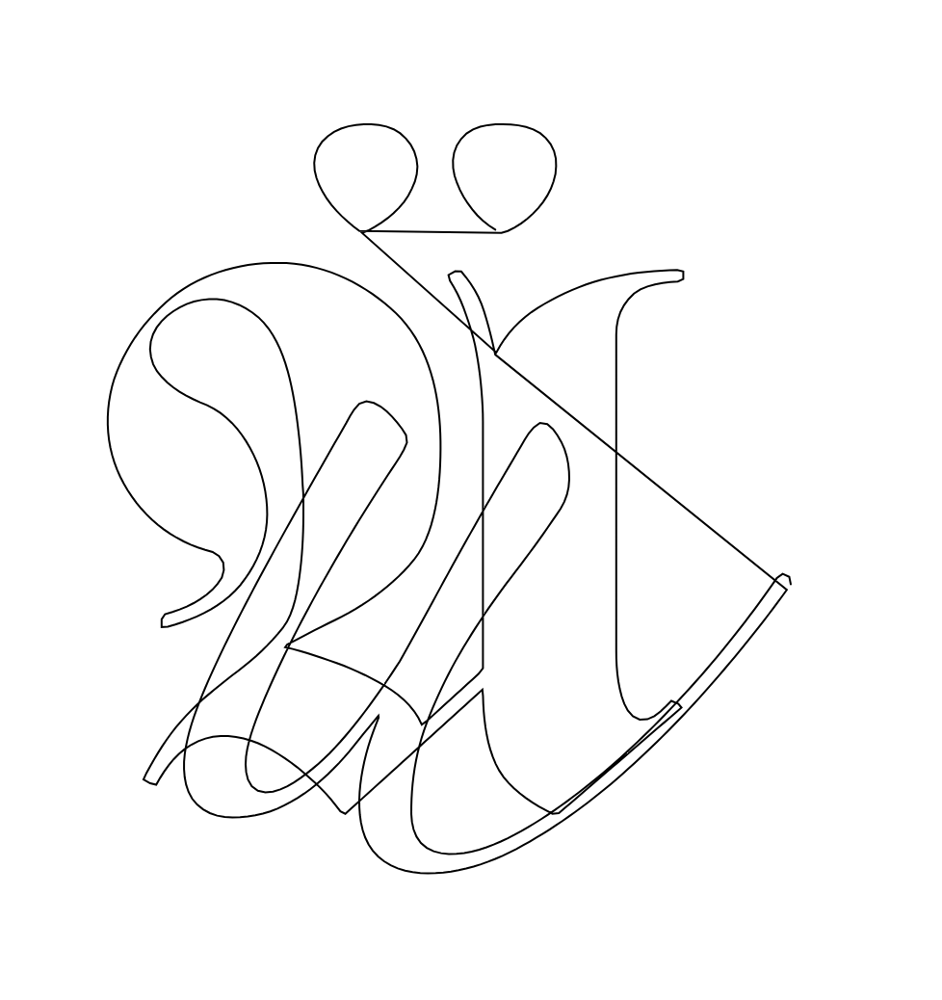

# bastard-glyphbot

[](docs/glyph.png)
---

A bot inspired by [glyphbot](https://github.com/lharby/glyphbot)

It is currently served via [Hono](https://hono.dev/) using [Bun](https://bun.sh).

#### Prerequisites

```
node
nvm
bun
hono
p5js
```

Tested with `node ^18`

#### Install
To install dependencies:

```bash
bun install
```

#### To run

```bash
bun dev
```

This will serve the client at `http://localhost:3000`

Refresh the page to generate new glyphs. 

If you use 
- `http://localhost:3000/index`
- `http://localhost:3000/test` 

You should see content sent from the server via Hono.

#### Notes

This project was created using `bun init` in bun v1.1.13. [Bun](https://bun.sh) is a fast all-in-one JavaScript runtime.
